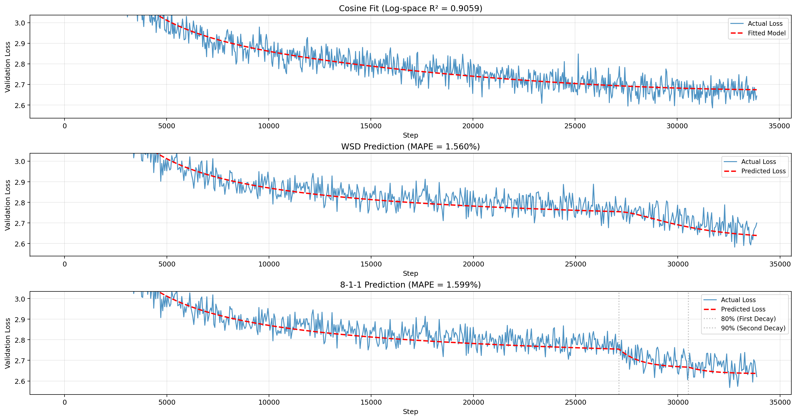
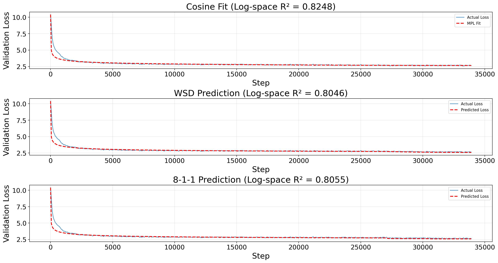
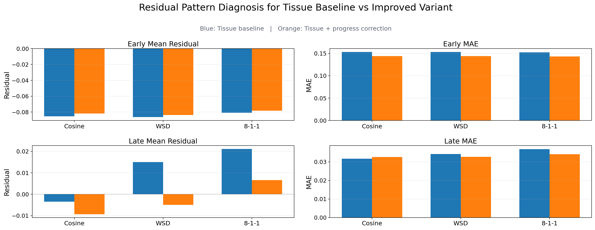

<!-- _class: title-slide -->

Topics in Deep Learning Theory - Task 2

# Predicting Loss Curves of LLM Pretraining

## Cosine-to-WSD transfer with reproduced scaling-law baselines and a progress-aware correction

Group: Tianze Lu · Ruoyu Wang · Feiyue Ye 
Student IDs: 2501110068 · 2501111525 · 2501111527 
Repository: https://github.com/Xiaoxiao-2002/TDLT2026-final-project.git

1.492%

WSD MAPE after our progress-aware Tissue correction

---

## Project Requirements Covered

<h3>Reproduction</h3>

Implement Tissue / momentum law and Multi-Power Law under the same cosine-to-WSD setting.

<h3>Diagnosis</h3>

Use residuals and schedule-wise prediction plots to locate baseline failure modes.

<h3>Method</h3>

Propose a lightweight correction fitted on cosine and tested on WSD and 8-1-1.

3

learning-rate schedules: cosine, WSD, 8-1-1

2

reproduced baselines: Tissue and MPL

1

interpretable progress-aware variant

---

## Motivation

Pretraining loss curves are often the earliest reliable signal of whether a run is healthy.

- Full LLM pretraining runs are expensive.
- Learning-rate schedules change the entire optimization trajectory.
- A transferable loss law lets us estimate a new schedule before running a full pretraining experiment.

<h3>Central question</h3>

Can a loss law fitted only on a cosine schedule predict the loss curve under WSD?

The project is about cross-schedule transfer, not only curve fitting.

---

## Data and Evaluation Protocol

<h3>Fit</h3>

Course pkl curve with cosine learning-rate schedule.

>

<h3>Predict</h3>

WSD is the required target schedule; 8-1-1 is an extra stress test.

>

<h3>Evaluate</h3>

Use log-space R², MAPE, MAE, RMSE, PredE, and residual plots.

 

input: learning-rate history
output: predicted loss curve
train: cosine
test: WSD + 8-1-1

---

## Related Methods We Reproduce

<h3>Tissue / Momentum Law</h3>

Compact and interpretable law based on learning-rate accumulated features.

<strong>Strength:</strong> stable fitting and readable parameters.

<strong>Risk:</strong> too rigid for the early-stage loss drop.

<h3>Multi-Power Law</h3>

More expressive: seven-parameter model for loss prediction across schedules.

<strong>Strength:</strong> richer functional form.

<strong>Risk:</strong> harder to fit and less directly interpretable.

<strong>Our design choice:</strong> keep Tissue's interpretability, then add the correction suggested by its residual pattern.

---

## Baseline 1: Tissue / Momentum Law

$$
L(t) = L_0 + A S_1(t)^{-\alpha} - C S_2(t)
$$

- Fit parameters on cosine.
- Predict WSD and 8-1-1 without refitting.
- Main metric for comparison: WSD MAPE.

1.560%

WSD MAPE for plain Tissue baseline

<strong>Observed issue:</strong> Tissue fits the general trend, but its residuals reveal biased predictions.

---

<!-- _class: figure-slide -->

## Tissue Baseline: Fit and Transfer

Cosine fit, WSD transfer, and 8-1-1 transfer from the saved Tissue baseline run.

---

## Baseline 2: Multi-Power Law

$$
L(t) = L_0 + A S_1(t)^{-\alpha} + B \cdot \mathrm{drop}(t)
$$

$$
\mathrm{drop}(t)=\sum_{i=1}^{t}(\eta_i-\eta_{i-1})\left[1-\left(1+c\eta_i^{-\gamma}(S_1(t)-S_1(i))\right)^{-\beta}\right].
$$

- Full pkl-based reproduction in `reproduce_2.py`.
- Downsamples the dense pkl curve before fitting, similar to a sparse-checkpoint setup.
- Serves as the more expressive reproduced contrast baseline.

0.805

average test log-space R² for MPL

---

<!-- _class: figure-slide -->

## Multi-Power Law: Fit and Transfer

MPL is more expressive, but the pkl-based reproduction is not stronger than the corrected Tissue variant on the chosen metric.

---

<!-- _class: figure-slide -->

## Limitation Analysis: Where Tissue Fails

Negative residuals mean actual loss is lower than predicted loss; the diagnostic shows where the correction moves bias closer to zero.

---

## Our Method: Progress-Aware Tissue Correction

$$
L(t) = L_0 + A S_1(t)^{-\alpha} - C S_2(t) - D e^{-\tau p(t)}
$$

<h3>What changes?</h3>

Add a decaying correction term over normalized progress p(t), where p(t) ranges from 0 to 1.

<h3>Why this term?</h3>

It is strongest early, then vanishes, matching the residual pattern found in the baseline.

<strong>Contribution:</strong> a small, interpretable schedule-transfer correction instead of a large black-box residual model.

---

## Main Quantitative Results

| Method | Fit metric | Cross-schedule metric | Role |
| --- | --- | --- | --- |
| Tissue baseline | cosine log-space R² = 0.905891 | WSD MAPE = 1.5601% 8-1-1 MAPE = 1.5994% | reproduced baseline |
| Tissue + progress correction | cosine log-space R² = 0.912989 | WSD MAPE = 1.4924% 8-1-1 MAPE = 1.4925% | our method |
| Multi-Power Law | train log-space R² = 0.824753 | test log-space R² = 0.805011 | reproduced contrast |

-4.3%

relative WSD MAPE reduction vs Tissue baseline

-6.7%

relative 8-1-1 MAPE reduction vs Tissue baseline

simple

only two added parameters: D and τ

---

## Reproducibility and Code Map

<h3>reproduce_1.py</h3>

Tissue baseline, our progress-aware variant, residual analysis, and diagnostic figure.

<h3>reproduce_2.py</h3>

Multi-Power Law reproduction with pkl loading, sampled checkpoints, metrics, and plot export.

<h3>experiments/</h3>

Saved configs, fitted parameters, predictions, residuals, and metrics for each run.

<h3>figures/</h3>

Main visual evidence used in the final slides and report.

---

## Division of Labor

<h3>Tianze Lu</h3>

Main code implementation, Tissue baseline reproduction, improved method experiments.

<h3>Ruoyu Wang</h3>

Final slide design, result organization and polishing.

<h3>Feiyue Ye</h3>

Literature notes, result checking, and final formatting support.

Source code, saved experiment artifacts, figures, report notes, and final slides are all included in the repository.

---

<!-- _class: conclusion -->

## Conclusions and Next Steps

- Cross-schedule loss prediction is feasible, but schedule-sensitive.
- Tissue is interpretable but misses the early-stage loss drop.
- MPL is a useful reproduced contrast baseline.
- Our progress-aware Tissue variant directly targets the observed failure mode.

<h3>Final takeaway</h3>

Residual diagnosis can guide small, interpretable improvements to scaling-law transfer.

Next: stronger schedule encoding, phase-wise fitting, or regularized residual modeling.

